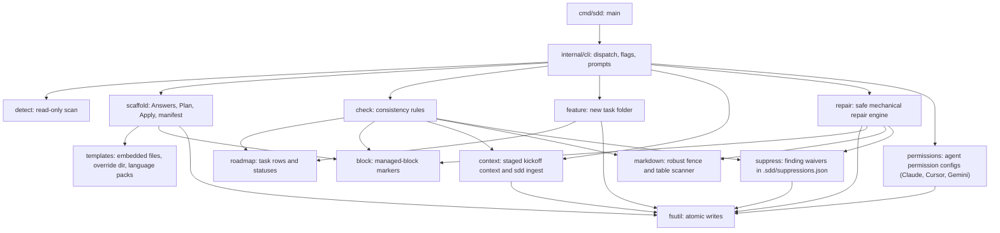

# TECH_STACK — sdd

> **ALWAYS BE DETERMINISTIC. Human approval resolves every decision.**

Status: living document · Last updated: 2026-10-26

**How to read this file.** Every decision has an ID (`D-xxx`) in the Decision register (§6) with a status:

- **Approved** — human-approved, binding.
- **Proposed** — agent or tool recommendation, not binding.
- **Open** — needs a decision at the named task.

Anything `sdd init` inferred from file names (commands, directories, CI, dependency manifests) is **unverified** until a task verifies it. Nothing marked Proposed or Open may be encoded in code until it is Approved.

## 1. Stack at a glance

| Layer | Choice | Status | Decision |
|---|---|---|---|
| Language | Go, standard library only | Approved | D-003, D-007 |
| Go language version in `go.mod` | 1.27 (aligns with host toolchain) | Approved | D-015 |
| Build | `make build` | Approved | D-004 |
| Test | `make test` (`make verify` = format check, vet, tests) | Approved | D-004 |
| Lint | `make lint` (golangci-lint v2) | Approved | D-004 |
| Format | `make fmt` (`gofmt -s`) | Approved | D-004 |
| Templates | Go `text/template`, embedded, with an optional override directory | Approved (embedding and override), Proposed (syntax) | D-013, D-016 |
| Distribution | Single static binary, no cgo | Approved | D-007 |

## 2. Design principles

1. **Pure planning, effects at the edge.** `scaffold.BuildPlan` reads the project and returns a plan without writing; `scaffold.Apply` is the only function that writes. Everything the human sees in a dry run is exactly what Apply does.
2. **Never overwrite.** Existing files are skipped or merged through a managed block; replacements require `--force` and always leave a backup.
3. **Determinism.** Time is injected; all lists are sorted or in canonical order; the same inputs produce byte-identical files (tested).
4. **Fail safe.** Invalid answers, unknown languages, broken templates, or unsafe paths are errors, never defaults.
5. **One source for each fact.** Markers live in `block`, roadmap parsing in `roadmap`, atomic writes in `fsutil`.

## 3. Architecture


```mermaid
flowchart TD
    M["cmd/sdd: main"] --> C["internal/cli: dispatch, flags, prompts"]
    C --> D["detect: read-only scan"]
    C --> S["scaffold: Answers, Plan, Apply, manifest"]
    S --> T["templates: embedded files, override dir, language packs"]
    S --> B["block: managed-block markers"]
    S --> U["fsutil: atomic writes"]
    C --> K["check: consistency rules"]
    K --> R["roadmap: task rows and statuses"]
    K --> B
    C --> F["feature: new task folder"]
    F --> R
    F --> U
    C --> X["context: staged kickoff context and sdd ingest"]
    X --> U
    K --> X
    K --> P["markdown: robust fence and table scanner"]
    K --> W["suppress: finding waivers in .sdd/suppressions.json"]
    C --> Y["repair: safe mechanical repair engine"]
    Y --> U
    Y --> B
    Y --> P
    Y --> W
    W --> U
    C --> Z["permissions: agent permission configs (Claude, Cursor, Gemini)"]
    Z --> U
```

### Data flow of `sdd init`

1. Refuse unsafe roots (`/`, `$HOME`); refuse an already-initialised project unless `--force`.
2. `detect` scans file names and a few manifests (read-only) and suggests mode, languages, and commands.
3. Answers come from flags, prompts (terminal only), or defaults (`--yes`), and are validated and put in canonical order.
4. `scaffold.BuildPlan` renders every file in memory and decides create, merge, replace, or skip per file.
5. The plan is printed; `--dry-run` stops here; otherwise the human confirms.
6. `scaffold.Apply` writes atomically, backs up anything replaced, and writes `.sdd/manifest.json` last.

## 4. Directory layout

```
cmd/sdd/              main: wires the real terminal, clock, and environment into cli.Run
internal/cli/         command dispatch, flag parsing, prompts, init/check/feature/prompt commands
internal/detect/      read-only project scan (languages, mode, suggested commands)
internal/scaffold/    answers, plan, apply, manifest
internal/templates/   embedded templates (data/), override directory, language packs
internal/check/       consistency rules (testdata/dbguard-kit is a real hand-made kit used as a regression fixture)
internal/feature/     creation of features/T-xxx-<slug>/
internal/roadmap/     parsing and editing of task rows
internal/block/       managed contract block markers
internal/fsutil/      atomic file writes
internal/install/     cross-platform user-level binary self-installation and PATH configuration
internal/permissions/ agent permission manifest generation (.claude, .cursor, .gemini)
internal/repair/      safe interactive mechanical repair engine (contract parity, table alignment)
internal/suppress/    finding waivers and baseline suppression register (.sdd/suppressions.json)
internal/version/     build version (set with -ldflags)
```

## 5. Conventions

- **Commit convention:** Conventional Commits (Proposed, D-005).
- **Tests:** standard library, table-driven, temporary directories, a fixed clock, and golden comparisons of two identical runs. Run `make verify`.
- **Verification commands:** recorded exactly in each task's `validation.md`.
- **No cgo; no third-party dependencies.**

## 6. Decision register

| ID | Decision | Status | Resolve at | Notes |
|---|---|---|---|---|
| D-001 | Project name `sdd` and its location `/Users/vikash/projects/sdd` | **Approved** 2026-10-26 | n/a | Module path `github.com/vikashkumar21/sdd` |
| D-002 | Spec-driven workflow with human gates; the human commits; agent contracts in CLAUDE.md, GEMINI.md, AGENTS.md | **Approved** 2026-10-26 | n/a | This repository uses its own kit |
| D-003 | Language: Go | **Approved** 2026-10-26 | n/a | |
| D-004 | Build, test, lint, and format toolchain | **Approved** 2026-10-29 | n/a | Makefile targets; verified locally with Go 1.27.3 and golangci-lint v2.15.0 in T-002 |
| D-005 | Commit message convention | Proposed | T-002 | Conventional Commits |
| D-006 | Build a thin own tool instead of adopting GitHub Spec Kit or OpenSpec | **Approved** 2026-10-26 | n/a | Human decision X1; hypothesis H2 in MISSION.md keeps this under review |
| D-007 | Go, standard library only, single static binary | **Approved** 2026-10-26 | n/a | Human decision X2 |
| D-008 | Command name `sdd` | **Approved** 2026-10-26 | n/a | Human decision X3; check `which sdd` for a clash on the maintainer's machine |
| D-009 | v1 scope: init, check, feature new, prompt, version; upgrade in v1.1 | **Approved** 2026-10-26 | n/a | Human decision X4 |
| D-010 | Brownfield policy: never overwrite; managed-block merge into agent files; a Discovery task is seeded | **Approved** 2026-10-26 | n/a | Human decision X5 |
| D-011 | Language packs in v1: Go, Java, Python, TypeScript, plus a generic fallback | **Approved** 2026-10-26 | n/a | Human decision X6 (Python and TypeScript added by the human) |
| D-012 | Agent files: CLAUDE.md, GEMINI.md, and AGENTS.md, all generated by default | **Approved** 2026-10-26 | n/a | Human decision X7; `--agents` selects a subset |
| D-013 | Template overrides and a manifest | **Approved** 2026-10-26 | n/a | Human decision X8 |
| D-014 | Tool repository `/Users/vikash/projects/sdd`, module `github.com/vikashkumar21/sdd` | **Approved** 2026-10-26 | n/a | Human decision X9 |
| D-015 | `go` directive in go.mod | **Approved** 2026-10-29 | n/a | Go 1.27 chosen by human decision; aligns module with host Go 1.27.3 toolchain |
| D-016 | Template syntax: Go `text/template` with `{{ }}`, strict (an unknown field is an error) | Proposed | T-002 | Override templates must not contain a literal `{{` |
| D-017 | Manifest schema 1, managed-block markers, and proposal format | **Approved** 2026-11-02 | n/a | Option A: Confirm manifest schema 1, `<!-- sdd:begin contract templates=<v> -->`, and `<file>.sdd-new` proposal files with unified diff previews as permanent compatibility surfaces |
| D-018 | Ingestion and semantic synthesis architecture | **Approved** 2026-10-29 | n/a | Option A: Agent-assisted staging (.sdd/context/); offline, deterministic, zero secrets; agent extracts under Gate 1 |
| D-019 | Jira task integration method | **Approved** 2026-10-29 | n/a | Option A for v1 (file/text-based JSON/Markdown/text ingestion), Option B (REST API client) as follow-up plugin |
| D-020 | Document/PDF ingestion protocol | **Approved** 2026-10-29 | n/a | Option A: text/string input directly, local CLI extraction or staging for multimodal agents, preserves D-007 stdlib purity |
| D-021 | Windows compatibility scope and sequencing | **Approved** 2026-10-30 | n/a | Option A: Harden T-007 for cross-platform os.Root determinism (filepath.IsLocal, device name rejection, Windows cross-build verification); schedule T-018 in M3 for full Windows support |
| D-022 | Agent permission manifest generation targets and merge behaviour | **Approved** 2026-11-02 | n/a | Option A: Native multi-agent manifests (Claude Code, Cursor, Gemini/Antigravity) with non-destructive merge |
| D-023 | Versioning bump timing and target version | **Approved** 2026-11-02 | n/a | Option Other: Complete T-017 first to finish Milestone 4, then bump release version directly to v1.0.0 |
| D-024 | Agent Skills standard adoption (`agentskills.io`) | **Approved** 2026-11-03 | n/a | Option A: Adopt Linux Foundation/Anthropic `agentskills.io` standard (`skills/<name>/SKILL.md`, YAML frontmatter, stdlib parser, progressive disclosure) |
| D-025 | Cross-platform self-installation architecture and locations | **Approved** 2026-11-04 | n/a | Option A: User-level self-installing binary (~/.local/bin on Unix, %LOCALAPPDATA%\Programs on Windows) with automatic PATH setup, plus universal 1-line scripts (install.sh/install.ps1) |
| D-026 | Code review specification, rubric, and task artifact (`review.md`) | **Approved** 2026-11-05 | n/a | Option A: Standard 4th task artifact (features/T-xxx/review.md), canonical agentskills.io code-review skill (skills/code-review/SKILL.md), 3-tier risk grading (🔴 Blocker, 🟡 Warning, 🟢 Minor), and sdd check strict verification |
| D-027 | Work typology and specialized lifecycle artifacts (Features, Bugfixes, Hotfixes, Spikes) | **Approved** 2026-11-05 | n/a | Option A: Top-level directories (features/, bugfixes/, hotfixes/, spikes/), unified sequential IDs (T-xxx) with Type attribute, failing reproduction test prerequisite for bugs, release-tag branching and post-mortems for hotfixes, non-merging disposable code for spikes, and dedicated CLI subcommands |
| D-028 | Git worktree concurrency and workspace isolation | **Approved** 2026-11-05 | n/a | Option A: Physical workspace isolation via Git Worktrees in .sdd/worktrees/T-xxx-<slug>/, standardized branch naming (feature/, bugfix/, hotfix/, spike/), fail-safe cleanup with backup, and sdd status tracking |
| D-029 | Two-tier git governance and Task Coordinator orchestration | **Approved** 2026-11-05 | n/a | Option A: Worker agents permitted autonomous commits strictly within their isolated task worktree/branch; workers forbidden from touching main. Task Coordinator checks plan.md file overlaps, qualifies merges (0 review blockers, tests passing), simulates merge/rebase, and presents GATE 2 to human expecting "APPROVED MERGE T-xxx". Export canonical skills/task-coordinator/SKILL.md with ensemble review standards (Spec Auditor + AppSec Specialist) |

## 7. Verified facts log (re-verify at the task shown; do not treat as permanent)

| Date | Fact | Source | Re-verify at |
|---|---|---|---|
| 2026-11-05 | Go 1.22.2 linux/amd64 builds the module; `go vet`, `gofmt -s`, all tests, and `go test -race` pass | Run in the build sandbox (see features/T-001-sdd-v1/validation.md) | M9 |
| 2026-11-05 | Interactive prompts, terminal detection, and confirmation work under a real pseudo-terminal (script(1)) | Run in the build sandbox | M9 |
| 2026-11-05 | Static binaries for darwin/arm64, darwin/amd64, linux/amd64, linux/arm64, windows/amd64, windows/arm64 cross-compile with `CGO_ENABLED=0`; only linux/amd64 and darwin/arm64 executed | Run in the build sandbox and make dist | M9 |
| 2026-11-05 | golangci-lint v2 was NOT available in the build sandbox: `.golangci.yml` is unverified | Absence of the tool | M9 |
| 2026-10-26 | GitHub Spec Kit and OpenSpec exist and are widely used (reported: about 115k and 55.9k stars, June 2026). Source: a secondary blog; not independently verified, and their approval model has not been compared with this contract | Secondary web source | H2 review |
| 2026-11-05 | Go 1.27.3 darwin/arm64 host toolchain verified; matches latest stable Go release on go.dev/dl | Verified on host and go.dev (T-005) | M9 |
| 2026-11-05 | golangci-lint v2.15.0 on darwin/arm64 clean after codebase lint fixes | Run on host machine (T-005 review) | M9 |
| 2026-10-29 | Hypothesis H2 validated: neither Spec Kit nor OpenSpec provides exact gate phrases, human-only commits, or decision registers | Research in T-005 review.md | H2 closed |
| 2026-11-05 | Go 1.27 os.Root on Windows rejects reserved device names (NUL, COM1..9, LPT1..9) via filepathlite.IsLocal and confines operations using native NT handles | Go stdlib src/os/root_windows.go inspection | M9 |
| 2026-11-05 | Monorepo detection up to depth 4, cache directory pruning (.turbo, .pnpm-store, etc.), and deterministic multi-language command composition verified | Run in internal/detect tests (T-010) | M9 |
| 2026-11-05 | Verified-facts expiry, prerequisite dependency drift, and feature status drift checkers active | Run in internal/check tests (T-011) | M9 |
| 2026-11-05 | Safe interactive repair engine (sdd check --fix) with unified diff preview, selective confirmation, and atomic backups verified | Run in internal/repair and cli tests (T-012) | M9 |
| 2026-11-05 | Finding suppressions, waiver register (.sdd/suppressions.json), interactive waivers, and stale waiver pruning verified | Run in internal/suppress, check, and cli tests (T-019) | M9 |
| 2026-11-05 | Agent permission manifest generation for Claude Code, Cursor, and Gemini/Antigravity with non-destructive merge verified | Run in internal/permissions and cli tests (T-013) | M9 |
| 2026-11-05 | Windows platform compatibility: isDriveRoot rejects drive/UNC roots, fsutil rejects colons/device names, check is CRLF-invariant, Makefile builds .exe | Run in tests and make dist (T-018) | M9 |
| 2026-11-05 | Linux Foundation / Anthropic agentskills.io standard YAML frontmatter parser, validation regex, progressive disclosure prompt catalog, and sdd-protocol export verified | Run in internal/skill, internal/check, and cli tests (M5) | M9 |
| 2026-11-05 | Cross-platform binary self-installation (sdd install), interactive double-click terminal setup, and universal 1-line web installer scripts (install.sh/install.ps1) with SHA256 checksum verification verified | Run in internal/install, cli, and script tests (M6) | M9 |
| 2026-11-05 | Code review specification (review.md, 3-tier risk grading, zero unresolved blockers check) and sdd status roadmap/gate aggregator verified | Run in internal/status, internal/check, and cli tests (M7) | M9 |
| 2026-11-05 | Two-tier agent hierarchy, Phase C.2 independent subagent audit, 3-loop circuit breaker, canonical skills/task-coordinator/SKILL.md, sdd prompt review, and template version 1.3.0 verified | Run in internal/skill, internal/cli, internal/check tests (T-032) | M9 |
| 2026-11-05 | Ensemble code review standards (Spec Auditor, AppSec Specialist, Pattern & Quality Auditor), sdd prompt review --lens (spec/security/pattern/all), and Review Triad templates verified | Run in internal/skill, internal/cli, internal/check tests (T-033) | M9 |

## 8. Dependency register

| Dependency | Purpose | Status |
|---|---|---|
| (none) | Standard library only (D-007) | Approved |
